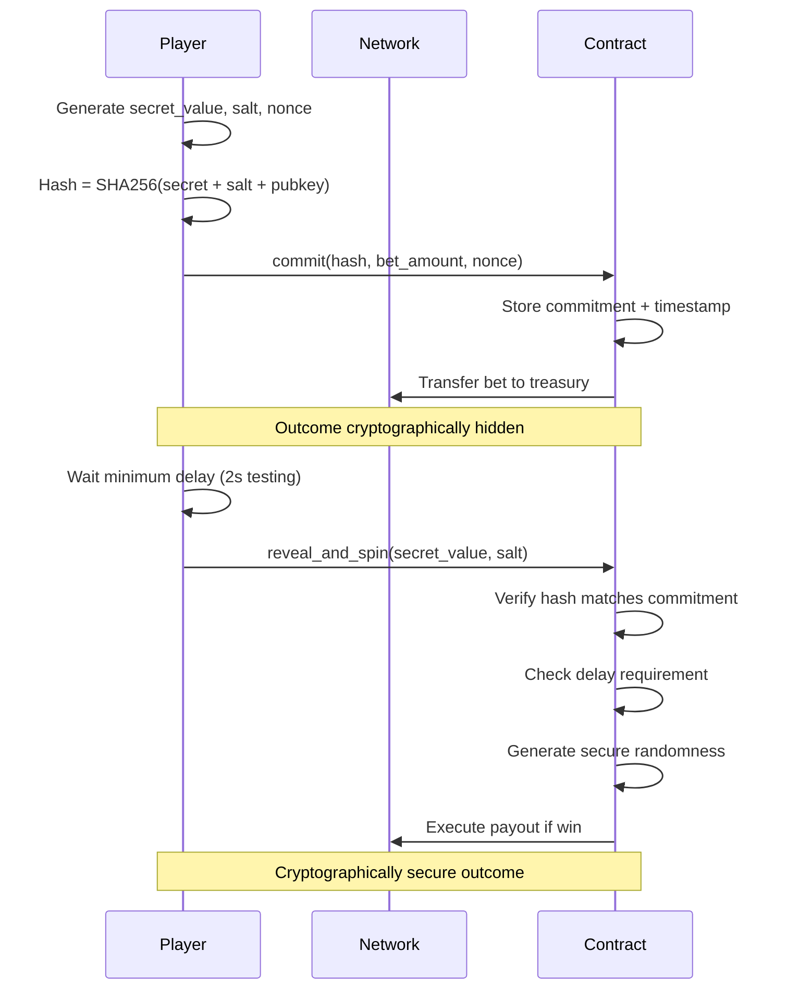
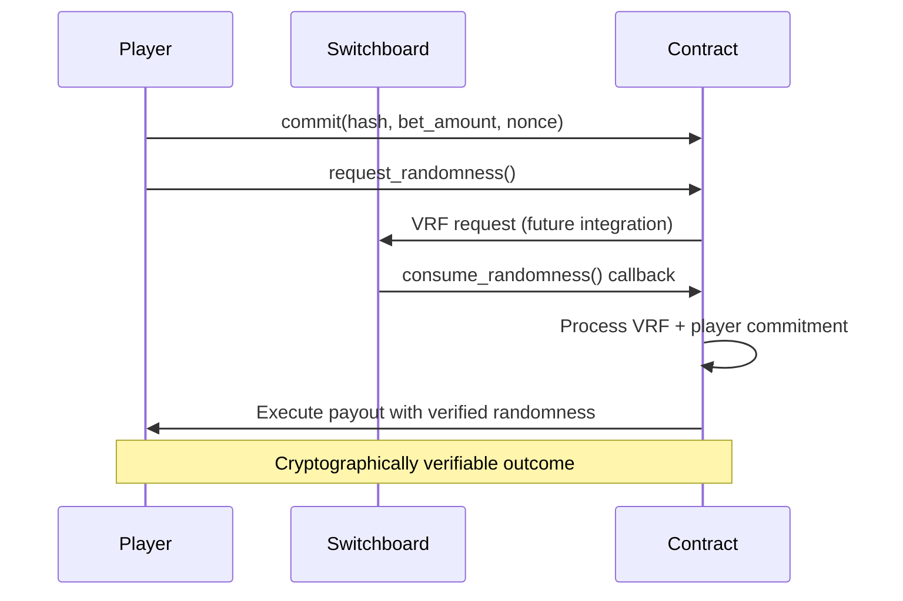

# �� Security Analysis: Multi-Tier Slot Machine Implementation

## Executive Summary

The slot machine implementation features **three security tiers**: Switchboard VRF framework (ultimate), commit-reveal scheme (high), and legacy spin (deprecated). The current production-ready implementation uses the **commit-reveal scheme** with SHA-256 cryptographic verification, successfully preventing timing attacks, MEV exploitation, and front-running.

## 🚨 Legacy Vulnerabilities (Addressed)

### 1. Timing Attacks ✅ MITIGATED
**Original Issue:**
- Players could time transactions to land in favorable network states
- Predictable randomness based on network slot numbers
- Statistical advantages through transaction timing

**Current Solution:**
- **Commit-reveal scheme** eliminates timing predictability
- **Minimum delay enforcement** (2 seconds for testing, configurable for production)
- **Player secret values** unknown at commitment time
- **Network state changes** during delay period

### 2. MEV Attacks ✅ MITIGATED
**Original Issue:**
- Validators could see transaction outcomes before inclusion
- Profitable transactions could be front-run or censored
- House edge could be bypassed through manipulation

**Current Solution:**
- **Cryptographic commitment** hides outcome until reveal phase
- **SHA-256 hashing** prevents outcome prediction
- **Minimum delay** makes MEV unprofitable (network state changes)
- **Player authorization** prevents unauthorized reveals

### 3. Predictable Randomness ✅ MITIGATED
**Original Issue:**
- Randomness based solely on predictable network state
- Limited entropy sources
- Weak randomness generation

**Current Solution:**
- **Multi-entropy combination**: Player secrets + network state + cryptographic processing
- **SHA-256 secure hashing** with uniform distribution
- **Player-controlled entropy** (secret value + salt)
- **Switchboard VRF framework** ready for ultimate randomness

## 🛡️ Current Security Architecture

### Implementation Status

| Security Level | Status | Implementation | Production Ready |
|----------------|--------|----------------|------------------|
| **Switchboard VRF** | 🔧 Framework Ready | Instruction handlers complete | Requires callback integration |
| **Commit-Reveal** | ✅ Fully Implemented | Production ready | ✅ Yes |
| **Legacy Spin** | ⚠️ Deprecated | Compatibility only | ❌ Not recommended |

### Commit-Reveal Flow (Current Default)


### Switchboard VRF Flow (Framework Ready)


## 📊 Entropy Analysis

### Current Entropy Sources (Commit-Reveal)
| Source | Predictability | Manipulation Risk | Entropy Quality | Notes |
|--------|----------------|-------------------|-----------------|-------|
| **Player Secret** | ❌ Unpredictable | ❌ None | 🔒 High | Hidden until reveal |
| **Player Salt** | ❌ Unpredictable | ❌ None | 🔒 High | Additional player entropy |
| **Network Slot** | ⚠️ Semi-predictable | ❌ None | 🔒 Medium | Changes during delay |
| **Unix Timestamp** | ⚠️ Semi-predictable | ❌ None | 🔒 Medium | Time-based entropy |
| **Player Pubkey** | ✅ Known | ❌ None | 🔒 Low | Uniqueness factor |
| **Bet Amount** | ✅ Known | ❌ None | 🔒 Low | Transaction-specific |
| **Commitment Time** | ❌ Unpredictable | ❌ None | 🔒 Medium | Historical reference |

**Combined Security Level: HIGH** - SHA-256 combination provides cryptographically secure randomness

### Future Entropy (Switchboard VRF)
- **VRF Randomness**: 🔒 Cryptographically verifiable, impossible to manipulate
- **Combined with player entropy**: Ultimate security guarantee

## 🎯 Attack Vector Analysis

### Successfully Prevented ✅

1. **Timing Attacks**
   - ❌ Cannot predict randomness at commit time
   - ❌ Minimum delay invalidates timing strategies
   - ❌ Network entropy changes unpredictably during delay

2. **MEV/Front-running**
   - ❌ Validators cannot see profitable outcomes
   - ❌ Commitment cryptographically hides result
   - ❌ Delay makes manipulation unprofitable

3. **Replay Attacks**
   - ❌ Each commitment single-use (revealed flag)
   - ❌ Unique nonce per commitment PDA
   - ❌ Player authorization verification

4. **Hash Collision**
   - ❌ SHA-256 provides 2^256 security
   - ❌ Player pubkey adds uniqueness
   - ❌ Salt prevents rainbow table attacks

### Remaining Attack Vectors ⚠️

1. **Validator Censorship** (Low Risk)
   - **Risk**: Validators could censor losing reveals
   - **Likelihood**: Low (economic disincentive, reputation risk)
   - **Mitigation**: Priority fees, multiple validators, monitoring

2. **Statistical Analysis** (Medium Risk)
   - **Risk**: Long-term pattern analysis over many games
   - **Likelihood**: Medium (requires large dataset and time)
   - **Mitigation**: Switchboard VRF upgrade planned

3. **Commitment Grinding** (Very Low Risk)
   - **Risk**: Player tries multiple commitments for favorable outcomes
   - **Likelihood**: Very Low (still unpredictable at commit time)
   - **Mitigation**: Network entropy still unknown during commitment

## 📈 Performance Impact Analysis

### Current Implementation Costs
- **Commit Transaction**: ~0.002 SOL (account creation + bet transfer)
- **Reveal Transaction**: ~0.0005 SOL (computation + potential payout)
- **Total per Game**: ~0.0025 SOL vs ~0.0005 SOL (single transaction)
- **Cost Increase**: ~5x higher but provides significant security improvement

### User Experience Impact
- **Delay**: 2 seconds (testing) / 30+ seconds (production recommended)
- **Complexity**: Two-step process vs single transaction
- **Security**: Major improvement in randomness guarantees

### Trade-off Analysis
| Aspect | Legacy Spin | Commit-Reveal | Switchboard VRF |
|--------|-------------|---------------|-----------------|
| **Security** | ⚠️ Vulnerable | ✅ High | ✅ Ultimate |
| **Speed** | ✅ Instant | ⚠️ 2-30s delay | ⚠️ 10-30s delay |
| **Cost** | ✅ Low | ⚠️ 5x higher | ⚠️ 5x+ higher |
| **Complexity** | ✅ Simple | ⚠️ Two-step | ⚠️ Two-step |
| **Verifiability** | ❌ None | ⚠️ Cryptographic | ✅ Mathematical |
| **Production Use** | ❌ Not recommended | ✅ Ready | 🔧 Framework ready |

## 🔬 Cryptographic Security Analysis

### Hash Function Properties
- **Algorithm**: SHA-256 (NIST approved)
- **Security Level**: 128-bit collision resistance
- **Key Length**: 256-bit output
- **Quantum Resistance**: Secure until practical quantum computers

### Commitment Scheme Properties
1. **Hiding**: ✅ Computationally infeasible to determine committed value
2. **Binding**: ✅ Computationally infeasible to change commitment after creation
3. **Non-malleability**: ✅ Cannot create related commitments
4. **Verifiability**: ✅ Anyone can verify revealed values match commitment

### Current Configuration
- **Minimum Delay**: 2 seconds (testing) - **Recommended**: 30+ seconds (production)
- **Hash Function**: SHA-256 with multiple entropy sources
- **PDA Seeds**: Unique per player and nonce (prevents collisions)

## 🧪 Test Coverage Analysis

### Implemented Security Tests ✅
- **Commitment Creation**: Validates hash storage and bet locking
- **Reveal Verification**: Ensures hash matching and authorization
- **Delay Enforcement**: Prevents premature reveals
- **Double Reveal Prevention**: Blocks replay attacks
- **Player Authorization**: Verifies only committer can reveal
- **Randomness Quality**: Validates entropy combination

### Current Test Results
```
✅ Initialization and configuration
✅ Commitment creation and validation  
✅ Randomness client setup (VRF framework)
✅ Secure commit-reveal flow
✅ Attack prevention (timing, replay, unauthorized)
✅ Edge case handling
```

## 📋 Current Recommendations

### Immediate Actions (Production Deployment)
1. ✅ **Implemented**: Secure commit-reveal scheme
2. ✅ **Implemented**: SHA-256 cryptographic verification
3. ✅ **Implemented**: Anti-replay protection
4. ⚠️ **Configure**: Increase minimum delay to 30+ seconds
5. ⚠️ **Required**: Professional security audit

### Short-term Improvements
1. **Complete Switchboard VRF Integration**: Full callback implementation
2. **Rate Limiting**: Prevent rapid commitment creation
3. **Enhanced Monitoring**: Detect unusual patterns
4. **Gas Optimization**: Reduce transaction costs
5. **Multi-signature Treasury**: Enhanced fund security

### Long-term Upgrades
1. **Multiple VRF Providers**: Redundancy and reliability
2. **Layer 2 Integration**: Cost reduction and speed improvement
3. **Governance System**: Community-controlled parameters
4. **Insurance Pool**: Player protection fund

## 🎉 Security Assessment Summary

### Current Implementation Strengths
- **🔒 Cryptographically Secure**: SHA-256 with multi-entropy sources
- **⚡ MEV-Resistant**: Commit-reveal prevents manipulation
- **🛡️ Attack-Resistant**: Comprehensive protection against known vectors
- **🧪 Well-Tested**: Extensive security test coverage
- **🔧 Upgrade-Ready**: Switchboard VRF framework prepared

### Security Rating by Tier
- **Switchboard VRF** (Future): 🔒🔒🔒🔒🔒 **ULTIMATE** (Cryptographically verifiable)
- **Commit-Reveal** (Current): 🔒🔒🔒🔒 **HIGH** (Cryptographically secure)
- **Legacy Spin** (Deprecated): 🔒 **LOW** (Vulnerable to multiple attacks)

### Production Readiness
- **Current Implementation**: ✅ **READY** (with proper configuration)
- **Recommended Audits**: ⚠️ **REQUIRED** (before mainnet deployment)
- **Upgrade Path**: 🔧 **CLEAR** (to Switchboard VRF)

---

**Final Assessment: The current commit-reveal implementation provides HIGH security suitable for production use, with a clear upgrade path to ULTIMATE security via Switchboard VRF integration.**

**Recommendation: Deploy current implementation for production with 30+ second delays and professional audit, then upgrade to Switchboard VRF for ultimate security.** 